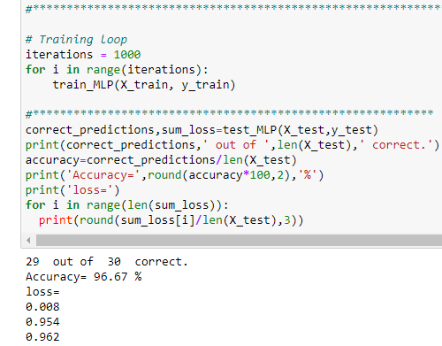

# Artificial-Neural-Network-to-train-IRIS-dataset

## Project Overview 
Designed and coded a multilayer ANN architecture gradient descent (feedforward and backward) from scratch to learn IRIS dataset using Pandas and Scikit-learn libraries.

---

## Dataset Information  
The **IRIS dataset** is a famous dataset in machine learning and statistics. It contains **150 samples** of iris flowers, categorized into three species:  
1. **Setosa**  
2. **Versicolor**   
3. **Virginica**  

Each sample has **four features**:  
🔹 Sepal length  
🔹 Sepal width  
🔹 Petal length  
🔹 Petal width

---

## Gradient Descent
For activation functions, I used **RELU** at the hidden layer and softmax at the output layer(since there are three classes to predict). For error calculation, I used **absolute error** and I used **one-hot encoding** during training.

---

## Results
  - Accuracy= 96.67 % 
  - loss at each output neuron= 0.008, 0.954, 0.962
